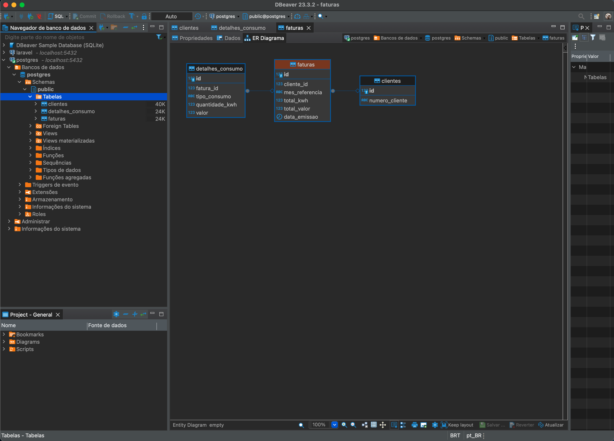

# Energy Billing Backend

Este repositório contém o backend para a aplicação de faturamento de energia.

## Início Rápido

Estas instruções fornecerão uma cópia do projeto em execução na sua máquina local para fins de desenvolvimento e teste.

### Pré-requisitos

- Node.js
- Yarn
- Docker

### Instalação

Para instalar as dependências do projeto, siga os passos abaixo:

1. Navegue até a pasta raiz do projeto.
2. Execute o comando:
   ```bash
   yarn
   ```

### Como Rodar a API

Para iniciar a API:

1. Após instalar as bibliotecas, navegue até a pasta raiz do projeto.
2. Execute o comando:
   ```bash
   yarn dev
   ```
3. Crie o banco de dados PostgreSQL usando Docker:
   ```bash
   docker run --name lumy -e POSTGRES_PASSWORD=password -d -p 5432:5432 postgres
   ```
4. Crie as tabelas no banco de dados PostgreSQL. Conecte-se ao banco de dados e execute os seguintes comandos SQL:
   ```sql
   CREATE TABLE clientes (
       id SERIAL PRIMARY KEY,
       numero_cliente VARCHAR(255) UNIQUE NOT NULL
   );

   CREATE TABLE faturas (
       id SERIAL PRIMARY KEY,
       cliente_id INTEGER REFERENCES clientes(id),
       mes_referencia VARCHAR(255) NOT NULL,
       total_kwh DECIMAL(10, 2) NOT NULL,
       total_valor DECIMAL(10, 2) NOT NULL,
       data_emissao DATE NOT NULL,
       url_pdf VARCHAR(255) NOT NULL
   );

   CREATE TABLE detalhes_consumo (
       id SERIAL PRIMARY KEY,
       fatura_id INTEGER REFERENCES faturas(id),
       tipo_consumo VARCHAR(255) NOT NULL,
       quantidade_kwh DECIMAL(10, 2) NOT NULL,
       valor DECIMAL(10, 2) NOT NULL
   );
   ```

### Uso

A API suporta os seguintes endpoints:

#### Upload de Faturas

- **`POST /upload-faturas`**: Faz o upload de um arquivo PDF de fatura e extrai seus dados. FormData com `file` (arquivo PDF) e `clienteId` (ID do Cliente).
- **`GET /fatura-url/:NumeroDoCliente`**: Recupera todas as URLs de faturas para um determinado ID de cliente.
- **`GET /dashboard?numeroCliente=7005400387`**: Extrai os dados para exibição no Dashboard.

### Testes

(Inclua informações sobre como executar os testes, caso haja.)

### Demonstração


